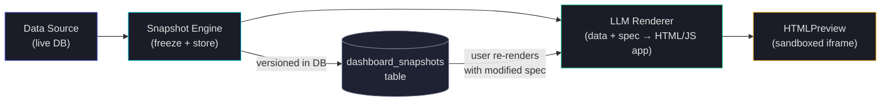
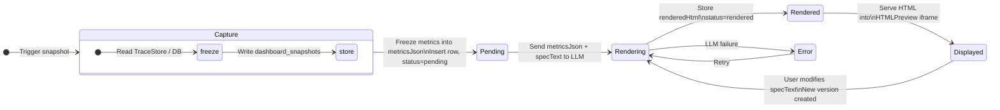
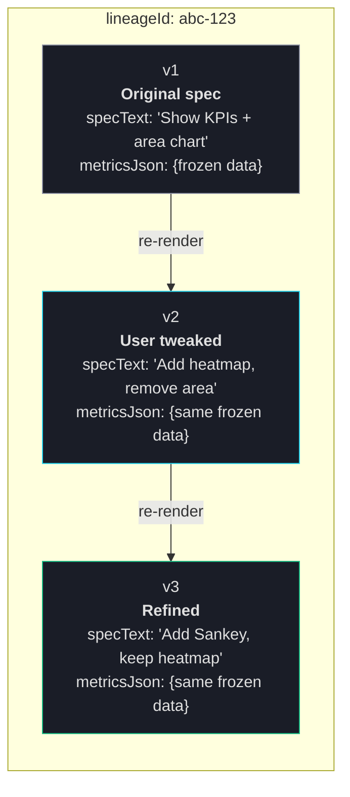
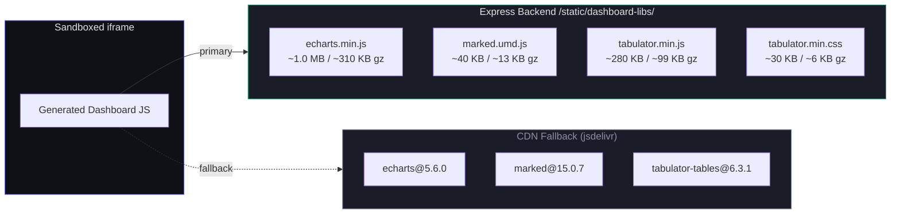
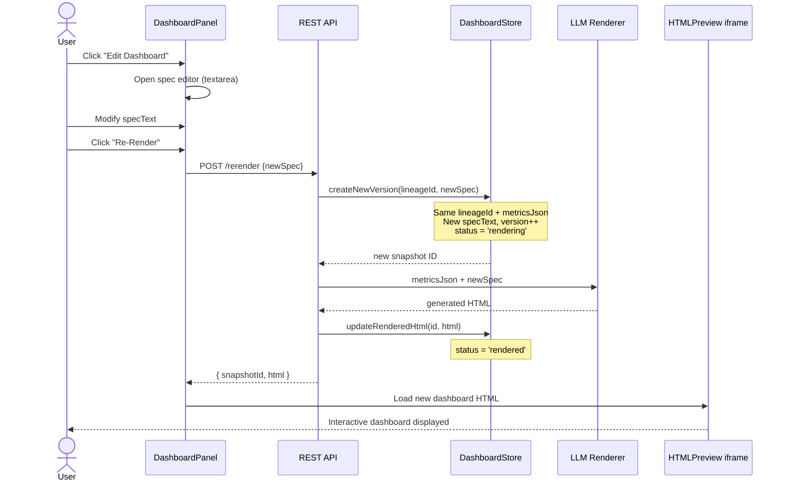
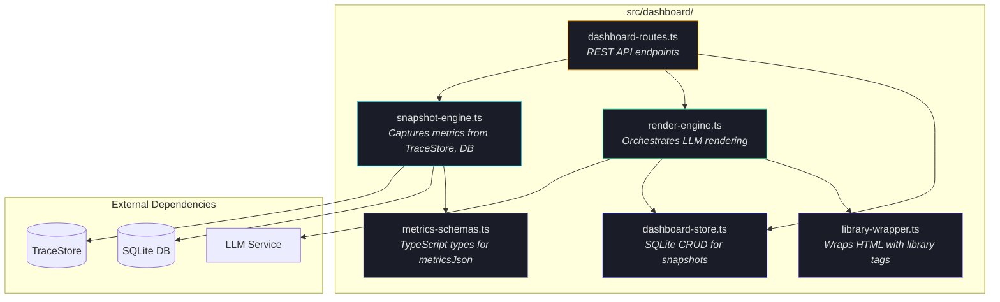
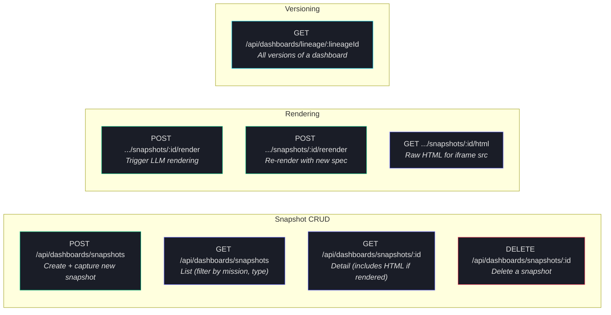
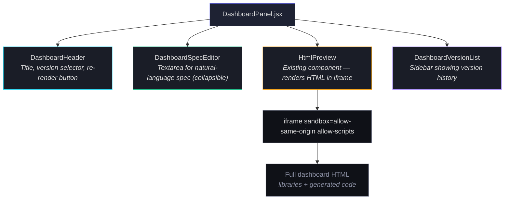
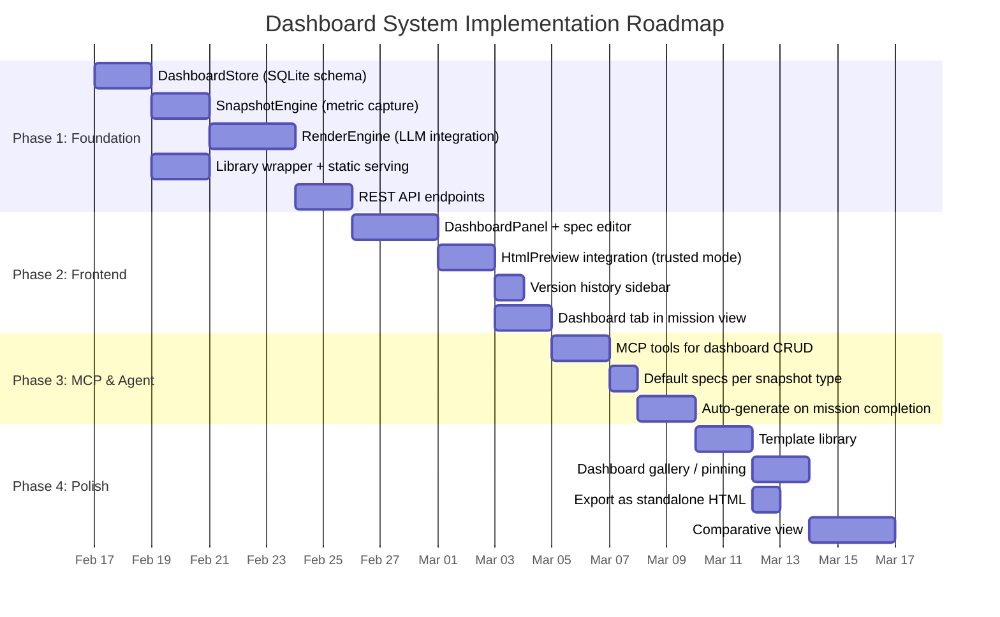

# Mission Dashboard System — Design & Technical Evaluation

> **Status:** Design Evaluation
> **Date:** February 13, 2026
> **Scope:** LLM-powered, versioned, self-contained dashboard rendering system

---

## 1. Overview

The Dashboard System renders **point-in-time metric snapshots** into **self-contained, interactive JavaScript applications** displayed inside sandboxed iframes. The key innovation: an LLM transforms raw data + natural-language instructions into a complete HTML/JS dashboard application — making every dashboard a bespoke, tailored BI mini-tool.

### Core Flow



### Design Principles

1. **Immutable data, mutable presentation** — The metrics snapshot is frozen at capture time and versioned in the database. The rendering (visual layout, chart types, emphasis) can be regenerated from the same data with different instructions.
2. **Self-contained output** — Each dashboard is a complete HTML document with inline CSS/JS and hardcoded data. No runtime API calls. Can be saved, shared, or compared.
3. **LLM as renderer** — Natural-language "dashboard specs" replace rigid template systems. Users describe what they want to see; the LLM writes the code.
4. **Library-backed, not from scratch** — The LLM references pre-loaded charting/table/markdown libraries via CDN (or local bundle). The generated code is glue + configuration, not low-level canvas drawing.

---

## 2. Data Model — Versioned Snapshots

### 2.1 Database Schema

```sql
-- ============================================================
-- Dashboard snapshots: frozen metric data at a point in time
-- ============================================================
CREATE TABLE dashboard_snapshots (
  id              TEXT PRIMARY KEY,            -- UUID
  conversationId  TEXT,                        -- Nullable; links to mission/conversation
  missionId       TEXT,                        -- Nullable; links to mission

  -- Snapshot metadata
  title           TEXT NOT NULL,               -- Human-readable title
  snapshotType    TEXT NOT NULL,               -- 'mission_report' | 'agent_analytics' | 'system_health' | 'custom'
  version         INTEGER NOT NULL DEFAULT 1,  -- Auto-increment per snapshot lineage
  lineageId       TEXT NOT NULL,               -- Groups versions of same dashboard (UUID)

  -- The frozen data
  metricsJson     TEXT NOT NULL,               -- JSON: the raw metric payload

  -- Rendering
  specText        TEXT NOT NULL,               -- Natural-language dashboard spec/instructions
  renderedHtml    TEXT,                        -- The generated HTML application (nullable until rendered)
  renderModel     TEXT,                        -- Which LLM model rendered this
  renderDurationMs INTEGER,                    -- How long the LLM took to generate
  renderTokensIn  INTEGER,                     -- Input tokens for the render call
  renderTokensOut INTEGER,                     -- Output tokens for the render call

  -- Timestamps
  createdAt       TEXT NOT NULL,               -- When the snapshot was taken
  renderedAt      TEXT,                        -- When the HTML was generated

  -- Status
  status          TEXT NOT NULL DEFAULT 'pending'  -- 'pending' | 'rendering' | 'rendered' | 'error'
);

CREATE INDEX idx_snapshots_lineage ON dashboard_snapshots(lineageId, version DESC);
CREATE INDEX idx_snapshots_mission ON dashboard_snapshots(missionId);
CREATE INDEX idx_snapshots_created ON dashboard_snapshots(createdAt DESC);
CREATE INDEX idx_snapshots_type ON dashboard_snapshots(snapshotType);
```

### 2.2 Metrics JSON Structure

The `metricsJson` field contains a structured JSON payload. The schema varies by `snapshotType` but follows a common envelope:

```typescript
interface DashboardMetrics {
  /** Schema version for forward compatibility */
  schemaVersion: number;

  /** When the data was captured */
  capturedAt: string;  // ISO 8601

  /** Time range the data covers */
  timeRange: {
    start: string;
    end: string;
    durationMs: number;
  };

  /** Aggregate KPIs (always present) */
  summary: {
    traceCount: number;
    llmCallCount: number;
    toolCallCount: number;
    agentCount: number;
    totalInputTokens: number;
    totalOutputTokens: number;
    totalDurationMs: number;
    errorCount: number;
  };

  /** Time-series data for charts */
  timeSeries?: TimeSeriesData[];

  /** Per-agent breakdown */
  agentMetrics?: AgentMetric[];

  /** Per-tool breakdown */
  toolMetrics?: ToolMetric[];

  /** Individual LLM call records (for detail tables) */
  llmCalls?: LlmCallSummary[];

  /** Individual trace records */
  traces?: TraceSummary[];

  /** Custom sections (extensible) */
  custom?: Record<string, unknown>;
}
```

### 2.3 Snapshot Lifecycle



### 2.4 Versioning & Lineage

When a user re-renders a dashboard with modified instructions:
- A **new row** is inserted with the same `lineageId` but incremented `version`
- The **same `metricsJson`** is copied (data doesn't change)
- The **new `specText`** reflects the user's modifications
- Previous versions remain accessible for comparison



This allows:
- Comparing how different specs render the same data
- Rolling back to a previous dashboard layout
- A/B testing dashboard designs

---

## 3. LLM Rendering Pipeline

### 3.1 Render Request Construction

The LLM receives a carefully structured prompt:

```
SYSTEM PROMPT:
You are a dashboard code generator. You produce a single, self-contained HTML file
that renders an interactive data dashboard. The HTML runs inside a sandboxed iframe.

Available libraries (pre-loaded via CDN <script> tags — do NOT add script tags):
- Apache ECharts 5.6.0: window.echarts — use for all charts
- marked.js 15.0.7: window.marked — use for markdown rendering
- Tabulator 6.3: window.Tabulator — use for interactive tables

Rules:
1. Output ONLY the HTML document. No explanation, no markdown fences.
2. Hardcode all data from the DATA section directly into JavaScript variables.
3. Use the libraries above — they are already loaded. Do not add <script> tags for them.
4. Use inline <style> for all CSS. Dark theme with background #0f1117.
5. Make all charts responsive using ResizeObserver or window resize events.
6. Include smooth load animations on charts.
7. Tables must be sortable and filterable.
8. The dashboard must work at widths from 800px to 1920px.

USER MESSAGE:
## DATA
{metricsJson}

## DASHBOARD SPEC
{specText}
```

### 3.2 Library Pre-loading Strategy

The generated HTML does NOT include `<script>` tags for libraries. Instead, the **host system wraps** the generated HTML with a standard preamble:

```html
<!DOCTYPE html>
<html lang="en">
<head>
  <meta charset="UTF-8">
  <meta name="viewport" content="width=device-width, initial-scale=1.0">

  <!-- Dashboard Library Stack (served from backend or CDN) -->
  <script src="{ECHARTS_URL}"></script>
  <script src="{MARKED_URL}"></script>
  <link href="{TABULATOR_CSS_URL}" rel="stylesheet">
  <script src="{TABULATOR_URL}"></script>
</head>
<body>
  <!-- LLM-generated content injected here -->
  {GENERATED_DASHBOARD_BODY}
</body>
</html>
```

This separation means:
- Library URLs can be changed without re-rendering dashboards
- Libraries can be served from the backend (offline mode) or CDN
- The LLM only generates the dashboard-specific code (~5-15KB typically)
- Version pinning is controlled centrally, not per-dashboard

### 3.3 Library Serving Options

| Strategy | Pros | Cons |
|----------|------|------|
| **CDN (jsdelivr/unpkg)** | Zero backend changes, always latest patches, cached globally | Requires internet, CDN outage = broken dashboards |
| **Backend static serve** | Offline-capable, version-locked, no external dependency | Must bundle ~2MB of library files, manual updates |
| **Hybrid** | CDN primary with backend fallback | More complex, but most resilient |

**Recommendation: Hybrid with backend primary.** Serve library bundles from `/static/dashboard-libs/` on the Express server. Fall back to CDN URLs if local files are missing. This ensures dashboards work offline (common in enterprise deployments) while CDN provides a safety net.



Total backend storage: ~1.35 MB uncompressed. Served with gzip: ~428 KB.

### 3.4 Re-Render Flow



---

## 4. Technical Stack Selection

### 4.1 Charting: Apache ECharts 5.6.0

**Selected over** ApexCharts, Chart.js, Plotly, D3.

| Criteria | ECharts | ApexCharts | Chart.js |
|----------|---------|------------|----------|
| Chart types | 30+ | ~20 | 8 |
| Heatmaps | Built-in | Built-in | No |
| Sankey/Sunburst | Built-in | No | No |
| Gauges | Built-in | RadialBar | No |
| Treemaps | Built-in | Built-in | No |
| Data zoom | Built-in | Built-in | Plugin |
| Toolbox | Built-in | No | No |
| Gzipped size | ~310 KB | ~135 KB | ~70 KB |
| LLM familiarity | Excellent | Good | Excellent |

**Rationale:** For a BI dashboard engine, chart variety is paramount. ECharts' 30+ chart types (including Sankey diagrams, sunburst charts, parallel coordinates, geographic maps, and 3D) enable dashboards that range from simple KPI views to sophisticated analytical visualizations. The declarative `setOption({})` API is ideal for LLM code generation — the LLM writes a configuration object, not imperative drawing commands.

The ~310 KB gzipped size is the trade-off. Our total stack is ~428 KB gzipped — well within budget and a one-time load per dashboard session.

**Note:** We also provide a sample using ApexCharts (`dashboard-sample-apexcharts.html`) for comparison. ApexCharts has superior out-of-the-box aesthetics and is ~175 KB lighter, making it a viable alternative if the extra chart types are not needed. A future enhancement could let users choose the charting engine per dashboard spec.

### 4.2 Markdown: marked.js 15.0.7

- ~13 KB gzipped — negligible overhead
- Fastest markdown parser
- Zero dependencies
- GFM support (tables, task lists, strikethrough)
- Active maintenance (last release: days ago)
- Simple API: `marked.parse(markdownString)` → HTML

### 4.3 Tables: Tabulator 6.3.1

- ~99 KB gzipped JS + ~6 KB CSS
- Sorting, filtering, pagination, column resizing, grouping
- Tree data and nested rows
- Export to CSV/JSON
- Column formatters (progress bars, badges, etc.)
- Virtual DOM rendering — handles 10K+ rows smoothly
- Zero dependencies

### 4.4 CSS: Custom Inline (no framework)

- 0 KB external — all styling is inline `<style>` in the generated HTML
- CSS Grid + Flexbox for layout
- CSS custom properties for theming
- No conflicts with library styles
- Complete control — the LLM generates exactly the CSS needed

### 4.5 Stack Budget

| Component | Library | Gzipped |
|-----------|---------|---------|
| Charting | ECharts 5.6.0 | ~310 KB |
| Markdown | marked.js 15.0.7 | ~13 KB |
| Tables (JS) | Tabulator 6.3.1 | ~99 KB |
| Tables (CSS) | Tabulator CSS | ~6 KB |
| **Total libraries** | | **~428 KB** |
| Generated dashboard code | (varies) | ~5-15 KB |
| **Total per dashboard** | | **~443-443 KB** |

All libraries are loaded once and cached by the browser. The per-dashboard generated code is typically 5-15 KB.

---

## 5. Integration Architecture

### 5.1 Backend Components



#### DashboardStore

Follows the same pattern as `TraceStore` — SQLite via `better-sqlite3`, WAL mode, prepared statements:

```typescript
class DashboardStore {
  // CRUD
  createSnapshot(opts: CreateSnapshotOpts): string;  // Returns snapshot ID
  getSnapshotById(id: string): DashboardSnapshot | undefined;
  getSnapshots(opts: SnapshotQueryOpts): DashboardSnapshot[];
  getSnapshotsByLineage(lineageId: string): DashboardSnapshot[];

  // Rendering
  updateRenderedHtml(id: string, html: string, meta: RenderMeta): void;
  markRenderError(id: string, error: string): void;

  // Versioning
  createNewVersion(lineageId: string, newSpec: string): string;

  // Cleanup
  cleanup(retentionDays?: number): number;
}
```

#### SnapshotEngine

Captures metrics from various sources into the standardized `DashboardMetrics` format:

```typescript
class SnapshotEngine {
  constructor(
    private traceStore: TraceStore,
    private db: Database,
  ) {}

  /** Capture a mission execution report */
  captureMissionReport(missionId: string): DashboardMetrics;

  /** Capture system-wide agent analytics */
  captureAgentAnalytics(timeRange: TimeRange): DashboardMetrics;

  /** Capture system health metrics */
  captureSystemHealth(): DashboardMetrics;

  /** Capture custom metrics from raw data */
  captureCustom(data: Record<string, unknown>): DashboardMetrics;
}
```

#### RenderEngine

Orchestrates the LLM call to generate dashboard HTML:

```typescript
class RenderEngine {
  constructor(
    private llmService: LLMService,
    private dashboardStore: DashboardStore,
  ) {}

  /** Render a dashboard from a snapshot */
  async render(snapshotId: string): Promise<string>;  // Returns rendered HTML

  /** Re-render with modified spec */
  async rerender(snapshotId: string, newSpec: string): Promise<string>;

  /** Build the full HTML document (libraries + generated content) */
  wrapWithLibraries(generatedBody: string): string;
}
```

### 5.2 REST API



### 5.3 Frontend Integration

The dashboard renders inside the existing `HtmlPreview` component. The integration flow:



The `HtmlPreview` component already supports:
- JavaScript execution (with user approval via "Execute" button)
- Fullscreen mode
- Resizable container
- Security sandboxing

For dashboards, we bypass the "Execute" approval gate since dashboard HTML is system-generated (not user-pasted). The `HtmlPreview` receives a prop like `trustedSource={true}` to auto-enable scripts.

### 5.4 MCP Server Integration

Extend the MCP server with dashboard tools so the coding agent can trigger dashboard generation:

```typescript
// New tools in src/mcp-server/tools/dashboards.ts
create_dashboard_snapshot   // Capture metrics and create a snapshot
render_dashboard            // Trigger LLM rendering of a snapshot
get_dashboard               // Retrieve a rendered dashboard
list_dashboards             // List available dashboards
```

---

## 6. Dashboard Spec Language

The `specText` is natural language that the LLM interprets. Users write instructions like:

```
Show me a mission execution report with:
- KPI cards for total steps, LLM calls, token cost, and duration
- A timeline chart showing agent execution order (Gantt-style)
- Token usage breakdown by agent as a treemap
- A table of all LLM calls sortable by token count
- Use a dark theme with blue/purple accent colors
- Highlight any errors or retries in red
```

### 6.1 Spec Conventions

While the spec is freeform, we establish conventions the LLM is trained to recognize:

| Keyword | Effect |
|---------|--------|
| `KPI cards` | Top-row summary metric cards |
| `timeline` / `Gantt` | Horizontal range bar chart |
| `heatmap` | Matrix visualization with color intensity |
| `treemap` | Hierarchical area chart |
| `Sankey` | Flow diagram with weighted links |
| `table` / `data table` | Interactive Tabulator table |
| `sparkline` | Inline mini-chart within a KPI card |
| `dark theme` / `light theme` | Color scheme selection |
| `highlight errors` | Red badges/annotations for error states |
| `compare to previous` | Show delta indicators (arrows, percentages) |
| `focus on [X]` | Emphasize a particular metric or dimension |

### 6.2 Default Specs by Snapshot Type

Each `snapshotType` has a built-in default spec that produces a reasonable dashboard without user customization:

**`mission_report` default:**
```
Executive mission report dashboard:
- Header with mission name, status badge, duration, and completion time
- KPI row: agent steps, LLM calls, tool invocations, total token cost, files modified
- Agent execution timeline (Gantt-style range bars, color by agent role)
- Token usage over time (stacked area chart: input vs output)
- Tool invocation heatmap (agents x tools matrix)
- LLM call detail table (sortable by duration, tokens, agent)
- Dark theme, professional BI styling
```

**`agent_analytics` default:**
```
System-wide agent analytics dashboard:
- KPI cards: total traces, LLM calls, total tokens, avg latency, error rate
- Token usage trend (24h stacked area with data zoom)
- LLM calls by workload (donut chart)
- Top tools by invocation count (horizontal bar)
- Agent activity heatmap (7-day, hourly)
- Recent traces table (sortable)
- Dark theme with indigo/cyan accent colors
```

---

## 7. Sample Dashboards

Two sample dashboards are provided for technical evaluation. Both are self-contained HTML files with hardcoded sample data, demonstrating what the LLM rendering pipeline would produce.

### 7.1 ECharts Sample: `docs/design/samples/dashboard-sample-echarts.html`

**Demonstrates:** Agent Analytics dashboard using Apache ECharts.

Showcases: KPI cards, stacked area (token usage over time with data zoom), donut (workload distribution), horizontal bar (tool rankings), gauge cluster (success rate, latency, cache hit), heatmap (7-day activity), Sankey (agent delegation flow), and an interactive sortable table.

**Evaluate for:**
- Chart variety and visual richness
- ECharts' declarative API suitability for LLM generation
- Animation quality and interactivity (zoom, tooltips, toolbox)
- Dark theme aesthetics

### 7.2 ApexCharts Sample: `docs/design/samples/dashboard-sample-apexcharts.html`

**Demonstrates:** Mission Execution Report using ApexCharts.

Showcases: KPI cards with mini sparklines, range bar (agent execution timeline), radial bar (token budget gauge), mixed line+bar (per-step analysis), treemap (token distribution), area with brush zoom (latency timeline), heatmap (tool usage matrix), markdown summary section, and a sortable data table.

**Evaluate for:**
- Out-of-the-box visual polish
- ApexCharts' strengths in mixed charts and range bars
- Responsiveness and animation quality
- Suitability for mission-specific reports

### 7.3 Evaluation Criteria

| Criteria | Weight | What to look for |
|----------|--------|-------------------|
| Visual impact | High | Does the dashboard look like a premium BI tool? |
| Chart variety | High | Can we express diverse analytical views? |
| Interactivity | Medium | Tooltips, zoom, sort, filter — do they work smoothly? |
| LLM generation fit | High | Is the API declarative enough for reliable code gen? |
| Load performance | Medium | Do charts render quickly? Any jank? |
| Responsiveness | Medium | Does the layout adapt to different widths? |
| Dark theme quality | Medium | Are colors, contrast, and readability good? |

---

## 8. Future Enhancements

### 8.1 Template Library
Pre-built dashboard templates (not LLM-generated) for common use cases. Users can select a template as a starting point, then customize via spec editing.

### 8.2 Multi-Engine Support
Allow spec to declare `engine: apexcharts` or `engine: echarts` to use different charting libraries for different dashboard styles.

### 8.3 Dashboard Sharing
Export dashboards as standalone HTML files that can be opened in any browser. Since they're self-contained, this is already inherently supported — just needs a "Download" button.

### 8.4 Comparative Dashboards
Side-by-side rendering of two snapshots from the same lineage to visualize changes over time. The spec could include `compare_with: <snapshot_id>` to overlay or juxtapose data.

### 8.5 Real-Time Mode
For running missions, stream metrics updates into the dashboard via WebSocket, with charts that animate incrementally. This would require a different rendering approach (live data binding rather than snapshot).

### 8.6 Dashboard Pinning
Pin particularly useful dashboard versions to a "Gallery" view, creating a library of proven dashboard layouts that can be applied to new data snapshots.

---

## 9. Risk & Mitigation

| Risk | Impact | Mitigation |
|------|--------|------------|
| LLM generates broken HTML/JS | Dashboard fails to render | Validate generated HTML; show error state with "retry" option; keep previous version accessible |
| CDN outage breaks dashboards | No charts render | Hybrid serving — local bundles as primary, CDN as fallback |
| Large metricsJson overwhelms LLM context | Truncated data, incomplete dashboard | Cap metricsJson at 50KB; summarize large datasets; paginate detail tables |
| Generated code has XSS vulnerability | Security risk in iframe | Sandbox attribute on iframe; CSP headers; no `allow-top-navigation` |
| Dashboard looks poor on small screens | Bad UX on mobile/narrow panels | Spec includes responsive guidelines; CSS Grid with auto-fit; min-width constraints |
| Re-render produces wildly different layout | Confusing UX | Include "layout hints" in spec that anchor structure; version comparison view |

---

## 10. Implementation Phases



### Phase 1: Foundation
- [ ] Create `DashboardStore` with SQLite schema
- [ ] Implement `SnapshotEngine` for mission reports
- [ ] Implement `RenderEngine` with LLM integration
- [ ] Add library-wrapper with local bundle serving
- [ ] REST API endpoints (create, render, get, list)

### Phase 2: Frontend
- [ ] `DashboardPanel` component with spec editor
- [ ] Integration with `HtmlPreview` (trusted source mode)
- [ ] Version history sidebar
- [ ] Dashboard tab in mission view

### Phase 3: MCP & Agent Integration
- [ ] MCP tools for dashboard CRUD
- [ ] Default specs for each snapshot type
- [ ] Auto-generate dashboard on mission completion

### Phase 4: Polish
- [ ] Template library
- [ ] Dashboard gallery/pinning
- [ ] Export as standalone HTML
- [ ] Comparative view
