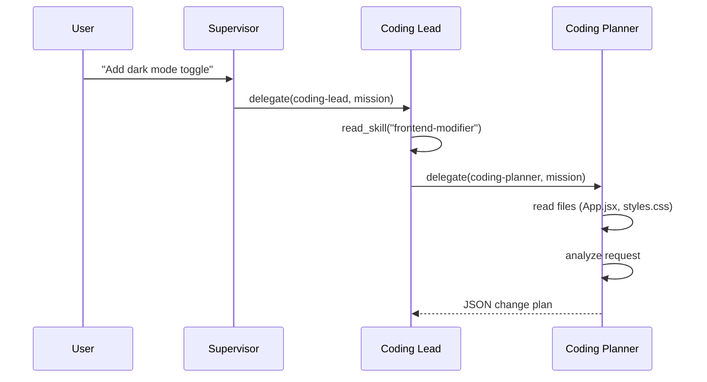
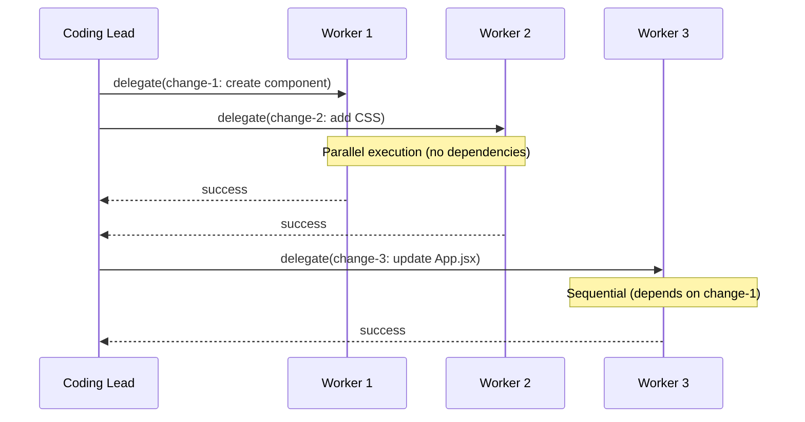
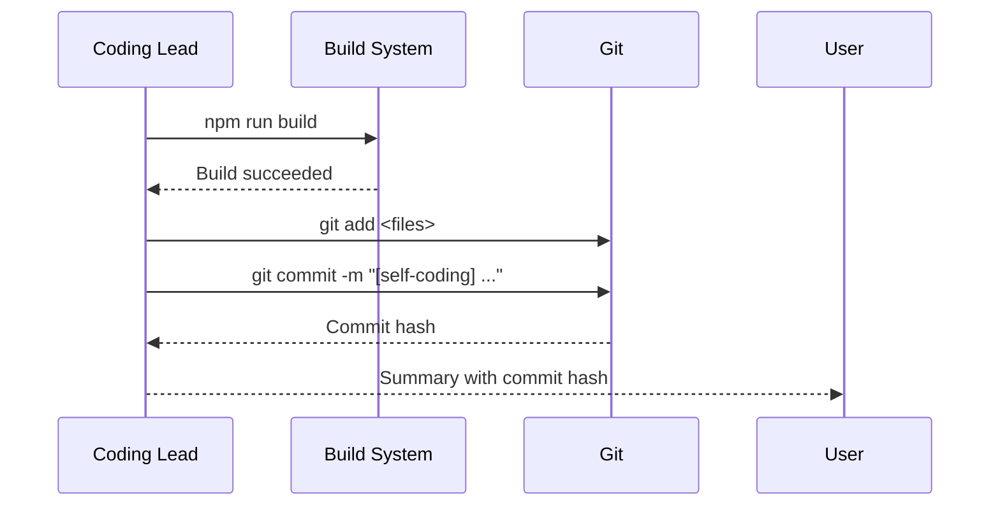

# Self-Modifying Frontend Code System

## Overview

This document describes the design of OlliBot's self-modifying software system, which allows users to request UI changes through conversation. The system uses a multi-agent architecture to plan, execute, validate, and commit frontend code changes.

## Table of Contents

1. [System Architecture](#system-architecture)
2. [Multi-Agent Workflow](#multi-agent-workflow)
3. [Agent Specifications](#agent-specifications)
4. [Native Tool: modify_frontend_code](#native-tool-modify_frontend_code)
5. [Code Change Specification](#code-change-specification)
6. [Code Identification Strategies](#code-identification-strategies)
7. [Edit Format Comparison](#edit-format-comparison)
8. [Validation Pipeline](#validation-pipeline)
9. [Git Integration](#git-integration)
10. [Future Improvements](#future-improvements)

---

## System Architecture

```
┌─────────────────────────────────────────────────────────────────────────────┐
│                              User Request                                    │
│                    "Add a dark mode toggle to the header"                   │
└─────────────────────────────────────────────────────────────────────────────┘
                                      │
                                      ▼
┌─────────────────────────────────────────────────────────────────────────────┐
│                           Supervisor Agent                                   │
│  • Detects frontend modification request                                    │
│  • Delegates to coding-lead                                                 │
└─────────────────────────────────────────────────────────────────────────────┘
                                      │
                                      ▼
┌─────────────────────────────────────────────────────────────────────────────┐
│                     Coding Lead Agent (Orchestrator)                        │
│  • Reads frontend-modifier skill for context                                │
│  • Delegates to coding-planner for change planning                          │
│  • Coordinates coding-workers for execution                                 │
│  • Validates build success                                                  │
│  • Commits changes to git                                                   │
└─────────────────────────────────────────────────────────────────────────────┘
                          │                           │
              ┌───────────┘                           └───────────┐
              ▼                                                   ▼
┌──────────────────────────────┐              ┌──────────────────────────────┐
│    Coding Planner Agent      │              │    Coding Worker Agent(s)    │
│  • Reads relevant files      │              │  • Executes atomic changes   │
│  • Analyzes change request   │              │  • Uses modify_frontend_code │
│  • Creates structured plan   │              │  • Reports success/failure   │
│  • Outputs JSON change spec  │              │  • Up to 3 in parallel       │
└──────────────────────────────┘              └──────────────────────────────┘
                                                          │
                                                          ▼
┌─────────────────────────────────────────────────────────────────────────────┐
│                         Vite Dev Server (HMR)                               │
│  • Detects file changes                                                     │
│  • Hot module replacement                                                   │
│  • Frontend reloads automatically                                           │
└─────────────────────────────────────────────────────────────────────────────┘
```

### Key Design Principles

1. **Separation of Concerns**: Planning, execution, and validation are handled by separate agents
2. **Atomic Changes**: Each modification is small and reversible
3. **Validation Before Commit**: Build must succeed before git commit
4. **Parallel Execution**: Independent changes can run concurrently
5. **Safety First**: Protected files, path validation, git history for rollback

---

## Multi-Agent Workflow

### Phase 1: Planning



### Phase 2: Execution



### Phase 3: Validation & Commit



---

## Agent Specifications

### Coding Lead Agent

| Property | Value |
|----------|-------|
| Type | `coding-lead` |
| Emoji | 👨‍💻 |
| Role | Orchestrator |
| Can Delegate To | `coding-planner`, `coding-worker` |
| Tools | `modify_frontend_code`, `read_skill`, `delegate`, `mcp.*` |
| Supervisor Can Invoke | Yes |

**Responsibilities:**
- Read the `frontend-modifier` skill for codebase context
- Delegate to planner for change specifications
- Coordinate workers (up to 3 in parallel)
- Validate build with `npm run build`
- Commit changes with descriptive message
- Report results to user

**Prompt File:** `src/agents/coding-lead.md`

### Coding Planner Agent

| Property | Value |
|----------|-------|
| Type | `coding-planner` |
| Emoji | 📐 |
| Role | Analyst |
| Can Delegate To | None |
| Tools | `modify_frontend_code` (read only) |
| Restricted To Workflow | `self-coding` |

**Responsibilities:**
- Read relevant source files to understand current state
- Analyze user request and identify affected components
- Break down changes into atomic operations
- Output structured JSON change plan
- Identify dependencies between changes

**Prompt File:** `src/agents/coding-planner.md`

### Coding Worker Agent

| Property | Value |
|----------|-------|
| Type | `coding-worker` |
| Emoji | 🔧 |
| Role | Executor |
| Can Delegate To | None |
| Tools | `modify_frontend_code` |
| Restricted To Workflow | `self-coding` |

**Responsibilities:**
- Execute a single atomic code change
- Read file if needed to verify target exists
- Apply the modification using appropriate edit type
- Report success/failure with details

**Prompt File:** `src/agents/coding-worker.md`

---

## Native Tool: modify_frontend_code

### Location

`src/tools/native/modify-frontend-code.ts`

### Purpose

Safely modify frontend source code files within the `/web` directory.

### Operations

| Operation | Description | Required Parameters |
|-----------|-------------|---------------------|
| `read` | Read file contents | `file_path` |
| `create` | Create new file | `file_path`, `content` |
| `edit` | Modify existing file | `file_path`, `edit_type`, `content` |
| `delete` | Remove file | `file_path` |

### Edit Types

| Edit Type | Description | Required Parameters |
|-----------|-------------|---------------------|
| `replace` | Find and replace text | `target`, `content` |
| `insert_before` | Insert before target | `target`, `content` |
| `insert_after` | Insert after target | `target`, `content` |
| `append` | Add to end of file | `content` |
| `prepend` | Add to beginning | `content` |
| `full_replace` | Replace entire file | `content` |

### Security Features

1. **Path Validation**: All paths must resolve within `/web` directory
2. **Path Traversal Prevention**: `../` is blocked
3. **Protected Files**: Cannot delete:
   - `src/main.jsx`
   - `index.html`
   - `vite.config.js`
   - `package.json`

### Input Schema

```typescript
interface ModifyFrontendCodeParams {
  file_path: string;      // Relative to /web (e.g., "src/components/Button.jsx")
  operation: 'create' | 'edit' | 'delete' | 'read';
  edit_type?: 'replace' | 'insert_before' | 'insert_after' | 'append' | 'prepend' | 'full_replace';
  target?: string;        // For replace/insert operations
  content?: string;       // For create/edit operations
  description?: string;   // For logging
}
```

### Output Schema

```typescript
// Success
{
  success: true,
  output: {
    path: string;
    operation: string;
    size?: number;
    lineCount?: number;
    previousSize?: number;  // For edits
    newSize?: number;       // For edits
  }
}

// Failure
{
  success: false,
  error: string;  // Descriptive error message
}
```

---

## Code Change Specification

### Format

The coding-planner outputs a JSON structure that the coding-lead uses to coordinate workers:

```typescript
interface CodeChangePlan {
  summary: string;              // Brief description of overall change
  files_to_read?: string[];     // Files read for context
  warnings?: string[];          // Important considerations
  changes: CodeChange[];        // Ordered list of changes
}

interface CodeChange {
  id: string;                   // Unique identifier (e.g., "change-1")
  file_path: string;            // Relative to /web
  description: string;          // Human-readable description
  operation: 'create' | 'edit' | 'delete';
  edit_type?: EditType;         // For edit operations
  target?: string;              // For replace/insert
  content?: string;             // New content
  priority?: number;            // Execution order (lower = first)
  depends_on?: string[];        // IDs of prerequisite changes
}
```

### Example Change Plan

```json
{
  "summary": "Add dark mode toggle with theme switching",
  "files_to_read": ["src/App.jsx", "src/styles.css"],
  "warnings": [
    "CSS variables for colors should be used consistently"
  ],
  "changes": [
    {
      "id": "change-1",
      "file_path": "src/components/DarkModeToggle.jsx",
      "description": "Create dark mode toggle component",
      "operation": "create",
      "content": "import { useState } from 'react';\n\nexport default function DarkModeToggle({ onToggle }) {\n  const [isDark, setIsDark] = useState(false);\n  \n  const handleToggle = () => {\n    setIsDark(!isDark);\n    onToggle(!isDark);\n  };\n  \n  return (\n    <button \n      className=\"dark-mode-toggle\"\n      onClick={handleToggle}\n      aria-label={isDark ? 'Switch to light mode' : 'Switch to dark mode'}\n    >\n      {isDark ? '☀️' : '🌙'}\n    </button>\n  );\n}\n",
      "priority": 1
    },
    {
      "id": "change-2",
      "file_path": "src/styles.css",
      "description": "Add dark mode CSS styles",
      "operation": "edit",
      "edit_type": "append",
      "content": "\n/* ============ Dark Mode Styles ============ */\n.dark-mode-toggle {\n  background: none;\n  border: 1px solid var(--border-color);\n  border-radius: 50%;\n  width: 40px;\n  height: 40px;\n  cursor: pointer;\n  font-size: 1.2rem;\n}\n\n.dark-mode-toggle:hover {\n  background: var(--hover-bg);\n}\n\n[data-theme='dark'] {\n  --bg-color: #1a1a2e;\n  --text-color: #eaeaea;\n  --border-color: #404040;\n}\n",
      "priority": 1
    },
    {
      "id": "change-3",
      "file_path": "src/App.jsx",
      "description": "Import DarkModeToggle component",
      "operation": "edit",
      "edit_type": "insert_after",
      "target": "import { useState, useEffect } from 'react';",
      "content": "\nimport DarkModeToggle from './components/DarkModeToggle';",
      "priority": 2,
      "depends_on": ["change-1"]
    },
    {
      "id": "change-4",
      "file_path": "src/App.jsx",
      "description": "Add dark mode state and toggle handler",
      "operation": "edit",
      "edit_type": "insert_after",
      "target": "function App() {",
      "content": "\n  const [darkMode, setDarkMode] = useState(false);\n  \n  useEffect(() => {\n    document.documentElement.setAttribute('data-theme', darkMode ? 'dark' : 'light');\n  }, [darkMode]);",
      "priority": 3,
      "depends_on": ["change-3"]
    }
  ]
}
```

---

## Code Identification Strategies

Based on research into state-of-the-art coding agents, here are the strategies for identifying relevant code:

### 1. Tree-sitter AST Parsing (Recommended)

**What it does:**
- Parses source code into an Abstract Syntax Tree
- Extracts function/component boundaries with exact positions
- Language-agnostic (supports JavaScript, JSX, CSS, etc.)

**Benefits:**
- Precise code boundaries (line/column positions)
- Understands language semantics
- Fast incremental updates

**Implementation:**

```typescript
// Future enhancement: Add tree-sitter parsing
interface ComponentInfo {
  name: string;
  type: 'function' | 'class' | 'arrow';
  startLine: number;
  endLine: number;
  startColumn: number;
  endColumn: number;
  imports: string[];
  exports: string[];
  hooks: string[];  // React hooks used
  children: ComponentInfo[];  // Nested components
}
```

### 2. Pattern-Based Search (Current Approach)

**What it does:**
- Uses unique text patterns to identify edit locations
- Requires exact match including whitespace

**Limitations:**
- Can fail if pattern isn't unique
- Sensitive to formatting changes
- No semantic understanding

**Best Practices:**
- Include enough context to make target unique
- Use distinctive code patterns (imports, function signatures)
- Avoid generic targets ("return", "div", "const")

### 3. Semantic Search with Embeddings (Future)

**What it does:**
- Creates vector embeddings of code chunks
- Finds semantically similar code via similarity search
- Understands intent even with different syntax

**Use Cases:**
- Finding related components
- Understanding code purpose
- Cross-file dependency analysis

---

## Edit Format Comparison

Research from [Aider](https://aider.chat/docs/more/edit-formats.html), [Cursor](https://cursor.com/), and academic benchmarks:

### Comparison Table

| Format | Accuracy | Token Efficiency | Complexity | Best For |
|--------|----------|------------------|------------|----------|
| **Whole File** | High | Low | Simple | Small files, new files |
| **Unified Diff** | 70-80% | High | Medium | Experienced LLMs (GPT-4) |
| **Search/Replace** | 85-95% | Medium | Medium | Most edits |
| **Line Numbers** | 60-70% | High | Low | Not recommended |

### Our Approach: Hybrid Search/Replace

We use search/replace as the primary method because:

1. **High Accuracy**: No line number drift issues
2. **Semantic Anchoring**: Target strings provide context
3. **Failure Detection**: Easy to detect when target not found
4. **Fallback Options**: Can switch to full_replace if needed

### Cursor's Two-Model Approach (Future Enhancement)

Cursor separates concerns:
1. **Sketch Model**: Powerful LLM generates change intent
2. **Apply Model**: Specialized model handles integration

This could improve our system by:
- Using main LLM for planning (what to change)
- Using fast LLM for execution (how to apply)

---

## Validation Pipeline

### Current Validation

```
┌─────────────────────────────────────────────────────┐
│ 1. Build Validation                                 │
│    cd web && npm run build                          │
│    • Catches import errors                          │
│    • Catches syntax errors                          │
│    • Validates module resolution                    │
└─────────────────────────────────────────────────────┘
```

### Enhanced Validation (Future)

```
┌─────────────────────────────────────────────────────┐
│ 1. Syntax Validation (per-file, fast)               │
│    • Parse with Babel/Esprima                       │
│    • Catches malformed JSX, missing brackets        │
│    • ~10ms per file                                 │
├─────────────────────────────────────────────────────┤
│ 2. Lint Validation (per-file, medium)               │
│    • ESLint with React plugin                       │
│    • Catches undefined variables, unused imports    │
│    • React hooks violations                         │
│    • ~100ms per file                                │
├─────────────────────────────────────────────────────┤
│ 3. Build Validation (whole project, slow)           │
│    • npm run build                                  │
│    • Catches cross-file issues                      │
│    • Module resolution, circular deps               │
│    • ~5-15 seconds                                  │
└─────────────────────────────────────────────────────┘
```

### What Can Be Validated Without Running

| Check | Tool | Catches |
|-------|------|---------|
| Syntax | Babel/Esprima | Invalid JSX, missing brackets |
| Lint | ESLint | Undefined vars, unused imports |
| Types | TypeScript | Type mismatches (if using TS) |
| Build | Vite | Import errors, circular deps |
| Style | Stylelint | Invalid CSS properties |

### What Cannot Be Validated Without Running

- Runtime logic errors
- Incorrect API usage
- State management bugs
- Visual rendering issues
- Race conditions

---

## Git Integration

### Commit Strategy

1. **Atomic Commits**: One commit per user request
2. **Descriptive Messages**: Include summary of changes
3. **Prefix**: All commits start with `[self-coding]`
4. **No Amend**: Always create new commits (preserves history)

### Commit Message Format

```
[self-coding] <brief summary>

Changes:
- <file1>: <description>
- <file2>: <description>

Requested: "<original user request>"
```

### Rollback Strategy

If user is unhappy with changes:
1. Find commit hash in response
2. Run `git revert <hash>` to undo
3. Vite HMR will reload with reverted code

---

## Future Improvements

### 1. Tree-sitter Integration

Add AST parsing for precise code identification:

```typescript
// Use tree-sitter-javascript for React/JSX parsing
import Parser from 'tree-sitter';
import JavaScript from 'tree-sitter-javascript';

const parser = new Parser();
parser.setLanguage(JavaScript);

function extractComponents(source: string) {
  const tree = parser.parse(source);
  // Query for function declarations, arrow functions, etc.
}
```

### 2. Pre-Edit Syntax Validation

Validate changes before applying:

```typescript
import { parse } from '@babel/parser';

function validateSyntax(content: string, filePath: string): boolean {
  try {
    parse(content, {
      sourceType: 'module',
      plugins: ['jsx'],
    });
    return true;
  } catch (error) {
    return false;
  }
}
```

### 3. ESLint Integration

Add lint checking after changes:

```typescript
import { ESLint } from 'eslint';

const eslint = new ESLint({
  useEslintrc: true,
  fix: false,
});

async function lintFile(filePath: string): Promise<LintResult> {
  const results = await eslint.lintFiles([filePath]);
  return {
    errors: results[0].errorCount,
    warnings: results[0].warningCount,
    messages: results[0].messages,
  };
}
```

### 4. Speculative Decoding for Diffs

Like Cursor, use speculative decoding:
- Feed original code chunks to model
- Model agrees on unchanged portions
- Only generates new tokens for changes
- Significantly faster diff generation

### 5. Component Dependency Graph

Build dependency graph for smarter planning:

```typescript
interface ComponentDependency {
  component: string;
  imports: string[];       // What this component imports
  importedBy: string[];    // What imports this component
  cssClasses: string[];    // CSS classes used
}
```

### 6. Visual Diff Preview

Before applying changes, show preview:
- Side-by-side diff view
- Syntax highlighted
- User can approve/reject each change

---

## Configuration

### Constants

Located in `src/self-coding/constants.ts`:

```typescript
export const SELF_CODING_WORKFLOW_ID = 'self-coding';

export const AGENT_IDS = {
  LEAD: 'coding-lead',
  PLANNER: 'coding-planner',
  WORKER: 'coding-worker',
};

export const MAX_CHANGES_PER_REQUEST = 10;
export const MAX_RETRIES_PER_CHANGE = 2;
export const SUB_AGENT_TIMEOUT_MS = 180_000;  // 3 minutes
export const BUILD_TIMEOUT_MS = 60_000;        // 1 minute
export const MAX_PARALLEL_WORKERS = 3;

export const FRONTEND_BASE_PATH = 'web';
export const PROTECTED_FILES = [
  'src/main.jsx',
  'index.html',
  'vite.config.js',
  'package.json',
];

export const BUILD_COMMAND = 'npm run build';
export const BUILD_WORKING_DIR = 'web';
export const AUTO_COMMIT = true;
export const COMMIT_PREFIX = '[self-coding]';
```

### Skill: frontend-modifier

Located in `user/skills/frontend-modifier/SKILL.md`:

Provides:
- Frontend directory structure
- Technology stack details
- Component patterns
- CSS conventions
- Build commands

---

## References

### Research Papers & Articles

- [Aider Edit Formats](https://aider.chat/docs/more/edit-formats.html)
- [Aider Benchmarks](https://aider.chat/docs/leaderboards/)
- [Diff-XYZ Benchmark](https://arxiv.org/html/2510.04905)
- [EDIT-Bench](https://arxiv.org/abs/2511.04486)
- [Cursor Features](https://cursor.com/features)
- [Tree-sitter Documentation](https://tree-sitter.github.io/tree-sitter/)
- [Semantic Code Indexing with AST](https://medium.com/@email2dineshkuppan/semantic-code-indexing-with-ast-and-tree-sitter-for-ai-agents-part-1-of-3-eb5237ba687a)

### Tools

- [ESLint](https://eslint.org/)
- [typescript-eslint](https://typescript-eslint.io/)
- [Babel Parser](https://babeljs.io/docs/babel-parser)
- [OpenCode](https://opencode.ai/)

---

## Appendix: File Locations

| Component | Location |
|-----------|----------|
| Native Tool | `src/tools/native/modify-frontend-code.ts` |
| Tool Types | `src/self-coding/types.ts` |
| Constants | `src/self-coding/constants.ts` |
| Coding Lead Prompt | `src/agents/coding-lead.md` |
| Coding Planner Prompt | `src/agents/coding-planner.md` |
| Coding Worker Prompt | `src/agents/coding-worker.md` |
| Agent Registry | `src/agents/registry.ts` |
| Delegate Tool | `src/tools/native/delegate.ts` |
| Skill Definition | `user/skills/frontend-modifier/SKILL.md` |
